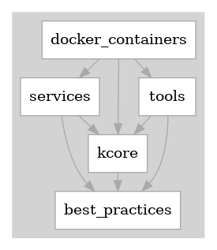

# ktools

- - -

## About The Project

This is a collection of computer-security-first services, tools, and
libraries, intended for moderately knowledgeable owners of Linux and
Circuit-Python based systems.

Some highlights:

- A smart-home control system

- A home security system (integrated with the smart-home system)

- A mechanism that provides authentication and automated secret retrieval
  without needing to store private keys or other secrets in plain-text on
  either the server or the clients.

- A collection of scripts and Docker containers designed to provide
  monitoring, maintenance and other administrative automation for a
  home-network of Linux servers (big ones and little ones like Raspberry PIs)

- Docker infrastructure for quick and easy maintenance of the provided
  containers, and easy addition of new ones

- A Python library and tools that underpin the above and a fair bit more.

- - -

## About the Design Philosophy

I try hard to make my systems minimal: in the volume of the code, the
complexity of the abstractions, and the external dependencies.  See
[etc/check-package-deps.sh](etc/check-package-deps.sh) for the small set of
requirements.

*It is my hope and intention that you will review my code and pick out the
pieces you want, rather than unquestioningly using the whole system.*

To this end, FAIR WARNING: **This code contains a simplistic tracking system.**
Under some circumstances it can "call home," and let me know you're using it.
Perhaps you consider this a fair price to pay for getting free functionality,
or perhaps you'd prefer it didn't.  You're going to have to read at least as
much as the [top-level Makefile](./Makefile) to turn it off.

Why do this?  As a warning and a reminder: when you download code from the
Internet, it can do *ANYTHING* -- violate your privacy, penetrate your
security, burrow into your system and leave vulnerabilities, either
deliberately or because of a lack of knowledge of its authors.  Some
open-source projects have many contributors, and hopefully those many eyes
will catch bad behavior.  But most FOSS has a small enough team that
collusion or lack of review is absolutely possible.

I put in the extra effort to make my systems simple so you can and will read
and understand the code; so you will get into the habit of not blindly
software just because it's free; and so you will put pressure on others that 
they also make their code and dependencies simple enough that shear complexity 
does not force you to accept software without review.

- - -

## About The Author

Ken Stillson retired from Google's central security team in 2021.  He left
with the rank of "Senior Staff" (level 7 out of 9).  Before that, he worked at
MITRE / Mitretek, assisting the US Government with various telecommunications
and security projects.  He left Mitretek as a "Senior Principal" (one level
shy of "Fellow"), and earned a "Hammer Award" from the then US Vice President,
for work that "makes the government work better and cost less."

Ken <<ktools@point0.net>> is now a maker, tinkerer, aspiring artist, and
free-range hacker (in the good sense, of course).

- - -

## Contents Overview

The **services** provide the business logic and web interfaces for much of the
ready-to-use functionality provided by this project.  Here's an
[overview](services.README.md) of what's ther.

The services can stand alone, but it's generally better when services are run
in a single-purpose **docker containers** (see the "general wisdom" section
for why).  These containers have just the minimal substance to accomplish
that.

The **"tools"** are functionality generally used in a mode ad-hoc manner that
don't need to be wrapped as services/containers, but can be run directly from
the command-line.  The ones provided come in several flavors, located in
different parts of the directory tree:

- tools for root: [overview](tools-for-root/README-root-tools.md)
- tools for users: [general](pylib/tools/README-user-tools.md) and [smart-home](pylib/home_control/README-home-control.md) control
- tools for docker:  [docker infrastructure](docker-infrastructure/README-docker-tools.md)
 
  <!-- slimy way to force a break to beyond the image -->

pylib/**kcore** is a collection of reasonably low-level abstractions needed to
implement all this other stuff.

See the included [readme](pylib/kcore/README.md) for a full description.  Some highlights:

   - The no-plaintext-secrets authN and secrets retriever mentioned above.

   - A very simple to use logging abstraction that integrates level filtering
     for various outputs (files, stdout, stderr, syslog), as well a web-based
     log retrieval.

   - A web server and client designed for simplicity of use, and which also
     provides a uniform interface for Python 2 or 3, Raspberry PI, and Circuit
     Python.  Also includes a bunch of Google-engineering-inspired "standard
     handlers" that make remote monitoring and debugging easier.

   - A GPIO and Neopixel abstraction that works on full Linux, Raspberry PIs,
     and Circuit Python boards.

The collection represents years of tinkering and fine-tuning, and it is hoped
that this code, even if only the structural concepts and some of the
techniques, may be of use to those either building their own systems, or just
trying to extend their Linux or Python expertise.

- - -

## Getting started

This system uses GNU Makefile's to build, test, and install its functionality.
If you're in a hurry, just type "make" in the top-level directory to get
started.

However, you'll probably find it more useful to review
[Readme-makefiles.md](Readme-makefiles.md) to find out more about what you'll
be getting and what your options are.

# # # # #

I'd like to call attention to the
[general-wisdom](general-wisdom/README-wisdom.md) section.  This directory
contains several decades of experience, distilled down to a few kilobytes.

Some highlights:

- Threat-based backup strategy- what threats to be ready for, and how to
  construct a unified solution based on those, with links to various
  implementation pieces throughout the other directories.

- General thoughts and approaches on security; not just the background and
  philosophy for the modules provided here, but also more general approaches
  and recommendations for passwords, encryption, using browsers safely, etc.

- Design schemes for Linux system administration.  Basically this is an
  explanation and road-map for the provided services and Docker images.  You
  can certainly use these t hings without reading the wisdom-docs, but chances
  are you'll end up missing out on some of the key benefits.  For example, to
  get the full value of running your own DHCP and DNS services, you really
  need to understand how the configuration is used to create pseudo subnets
  with different levels of trust.
